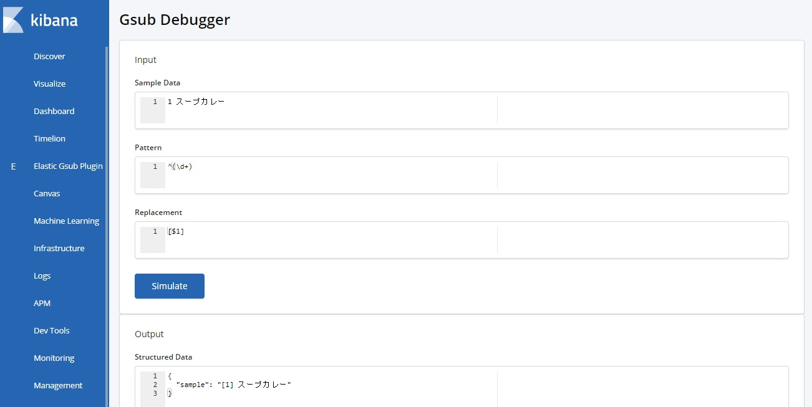

# elastic-gsub-plugin

> UI for elasticsearch Gsub Processor



---

## How to use?

### What is this?
This Kibana plugin is the UI for [Gsub Processor](https://www.elastic.co/guide/en/elasticsearch/reference/current/gsub-processor.html).

### Method of operation
1. Enter 「Sample Data」「Pattern」「Replacement」
2. Press 「Simulate」
3. See「Structured Data」

## Install

```bash
./bin/kibana-plugin install <PATH_OR_URL_TO_YOUR_ZIP_FILE>
```
example: kibana 6.6.0.

```bash
./bin/kibana-plugin install https://github.com/taku333/elastic_gsub_plugin/releases/download/6.6.0/elastic_gsub_plugin-6.6.0.zip
```

The latest version is for kibana 6.6.0.

| Kibana version | compatibility |
| ---------- | ------- |
| 6.6.1 |  &#10003; |
| 6.6.0 |  &#10003; |
| 6.5.4 |   |

---

## development

See the [kibana contributing guide](https://github.com/elastic/kibana/blob/master/CONTRIBUTING.md) for instructions setting up your development environment. Once you have completed that, use the following yarn scripts.

  - `yarn kbn bootstrap`

    Install dependencies and crosslink Kibana and all projects/plugins.

    > ***IMPORTANT:*** Use this script instead of `yarn` to install dependencies when switching branches, and re-run it whenever your dependencies change.

  - `yarn start`

    Start kibana and have it include this plugin. You can pass any arguments that you would normally send to `bin/kibana`

      ```
      yarn start --elasticsearch.hosts http://localhost:9220
      ```

  - `yarn build`

    Build a distributable archive of your plugin.

  - `yarn test:browser`

    Run the browser tests in a real web browser.

  - `yarn test:server`

    Run the server tests using mocha.

For more information about any of these commands run `yarn ${task} --help`. For a full list of tasks checkout the `package.json` file, or run `yarn run`.
